<!-----  SALUDO ---->
<p align="center">
  <a href="https://github.com/DenverCoder1/readme-typing-svg"></a>
</p>

<!--- My Social Networks:-->
<p align="center">
  <a href="https://www.linkedin.com/in/gregoy-jhair-zambrano-6a6a13273?lipi=urn%3Ali%3Apage%3Ad_flagship3_profile_view_base_contact_details%3BRd%2BEmYf6Q1%2BYn%2FMGcRjF%2Fw%3D%3D"></a>
  &#8287;&#8287;&#8287;&#8287;&#8287;
  <a href="https://twitter.com/jhairzp27"></a>
  &#8287;&#8287;&#8287;&#8287;&#8287;
  <a href="https://www.instagram.com/jhair_zambrano" alt="Instagram" title="Instagram"></a>
  &#8287;&#8287;&#8287;&#8287;&#8287;
  <a href="https://www.reddit.com/user/Jhairzp27/"></a>
  &#8287;&#8287;&#8287;&#8287;&#8287;
  <a href="https://paypal.me/jhairzp27"></a>
  &#8287;&#8287;&#8287;&#8287;&#8287;
</p>

<table align="right" style = "margin-top: 11px">
 <tr><td><a>Español</a></td></tr>
 <tr><td><a href="https://github.com/Jhairzp27/Jhairzp27/blob/main/README.md">Inglés</a></td></tr>
</table>

# 😜 Acerca de mi:

<p>
<a href = "https://github.com/Jhairzp27/Jhairzp27/blob/main/gifs/MatrixOrange.gif" alt = "MatrixOrgange" title = "MatrixOrange">
</a>

<p align = "center">
<a href="https://www.epn.edu.ec/welcome-to-ecuador-the-middle-of-the-world-and-to-its-top-university/"></a> Estudio en la Escuela Politécnica Nacional.
</p>

```
Hola-soy-jhairzp27@github
-----------------------------------------------------------------------------------------------
🙋  Me entusiasma crear aplicaciones innovadoras y resolver problemas complejos en el mundo.
    de la tecnología.
🤝  Me adapto e integro fácilmente en diversos entornos de trabajo,
    fomentando una colaboración fluida y contribuyendo eficazmente a la dinámica del equipo.
🧑‍💻  Me apasiona aprender nuevas tecnologías e idiomas.
🚩  Aspiro contribuir en proyectos interesantes y crear soluciones de software significativas.
🎵  Me encanta el heavy metal, el rock, el indie, el pop, el reaggae y la música suave.
-----------------------------------------------------------------------------------------------
```

[](https://github.com/Jhairzp27)

###  Lenguajes de programación:

<p align="center">
  <a href="https://github.com/tandpfun/skill-icons#icons-list"></a>
  <a href="https://github.com/tandpfun/skill-icons#icons-list"></a>
</p>

### ⚒️ IDES:

<p align="center">
  <a href="https://skillicons.dev">
    
  </a>
</p>

### 🔎 Herramientas:

<p align="center">
  <a href="https://skillicons.dev">
    
  </a>
</p>

##

|🔝Lenguajes mas usados   |   🎧Escuchando:|
|-------------------|-----------------|
||[](https://open.spotify.com/user/9weo8xzgmjckskm60cl62w34g?si=15a31546f79a485c)|

##  Mis estadísticas en GitHub:

<div align = "center">

  

[//]: # (  ![Jhairzp27 Estadisticas]&#40;./images/stats.svg&#41;)

  

  

</div>

## 🤝 Contribuciones en otros repositorios:

<div align ="center">
  
  

  

  <!-- -->
  
</div>

## 💰 Puedes apoyarme en:

<a href="https://paypal.me/jhairzp27"></a>
  &#8287;&#8287;&#8287;&#8287;&#8287;

**Paypal**

## 🏆 Trofeos de GitHub:


<!--[](https://paypal.me/jhairzp27)-->
